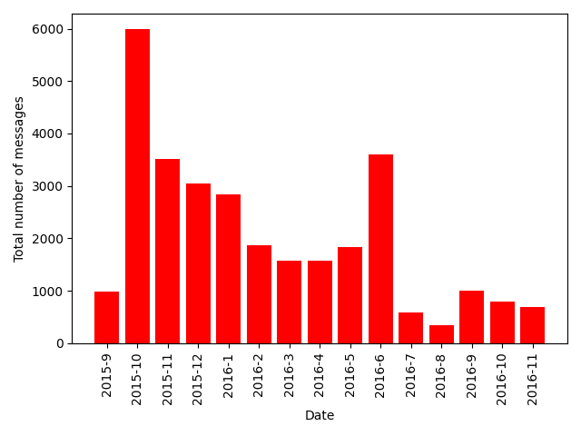
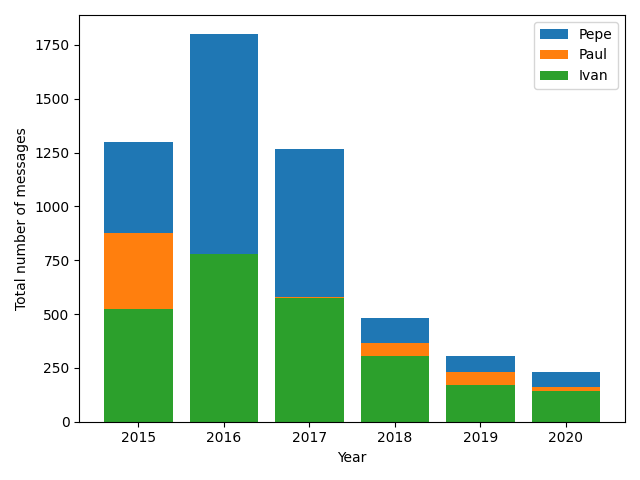
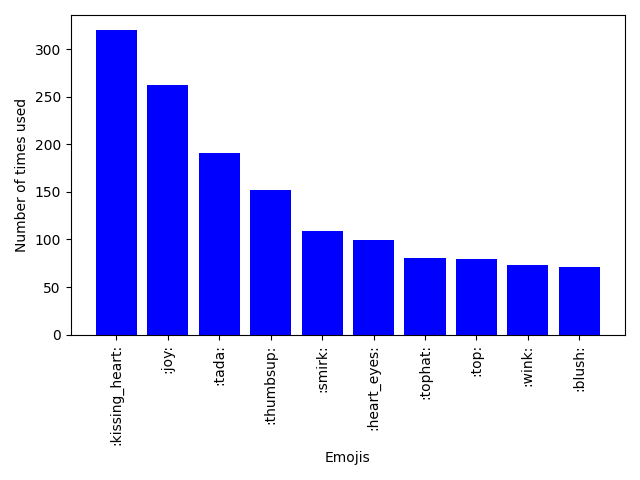
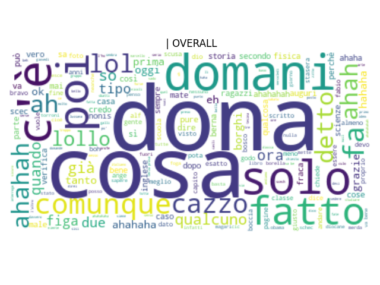
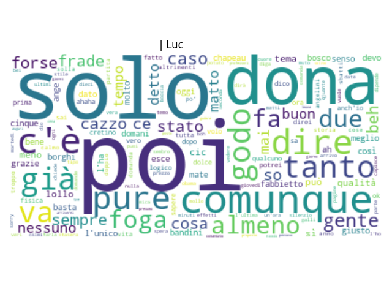
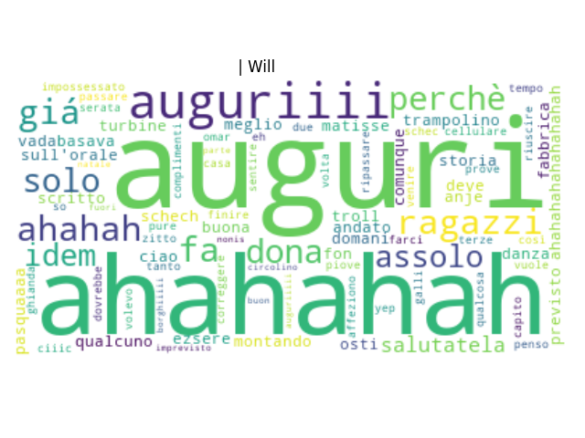

# WhatsApp Analysis
A data analysis and visualization tool for WhatsApp chats

## Example
Here's and example of what these scripts are able to create

### Plots
**Different plots for different timeperiods**

**Overall and per author emoji counters**

Friend: 
😂 -- 43 
👍 -- 30 
🎉 -- 30 
🎩 -- 27 
😏 -- 17

## Wordclouds
**Overall**

**Someone really enjoying himself**

**Someone who is always happy**

**Someone who barely shows up**

